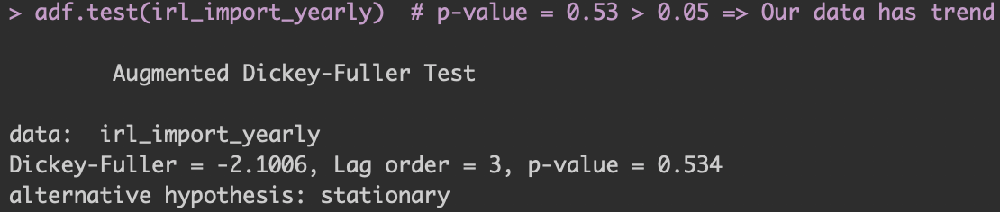

# Statistical Time Series Analysis for Irish import trade Data and Forecasting

**Experience Level:** Intermediate

**Technology Used:** R

**Skills Used:** Visualing Time Series, testing for Time-series components (<ins>Augmented Dickey-Fuller(ADF) test, Seasonal Decomposition test, Hodrick-Prescott Filter</ins>), fitting models to the time-series data, Comparison of models using <ins>AICc and RMSE</ins> scores, Evaluation using <ins>Ljung-Box test of Autocorrelation, and ACF/Residual plot</ins>, <ins>Forecasting</ins> 3 time periods ahead.

---

#### Summary of the Experiment:

1. The aim of the experiment was to perform forecasting on Ireland import trade in EUR(million) for 3 consecutive years of 2020, 2021, and 2022.
2. Steps from visually understanding the time-series data, checking for various components in the series, fitting different models to the data to comparing and evaluating the models and finally forecasting using a selected models are performed in the experiment.
3. Checks are performed for time-series components such as trend, seasonality and cycles using statistical tests for each component.
    1. Based on components present particular suited models are selected to fit the data
4. Four models were selected to fit the time series data were Naive model, Holts model, ETS model, ARIMA model.
    1. All the models are evaluated and compared on the AICc and RMSE metrics
    2. Best among all the models is selected for forecasting
5. Before performing the forecast model is first evaluated using statistical tests for no residual correlation (Ljung-Box test) and residual plot and ACF plot to check goodness of fit.
6. Three Forecasts are then made using the selected ARIMA 022 model.

---

**Objectives of the Project:**
* To fit a time-series model to perform forecast for Ireland import trade for years 2020, 2021, and 2022.
* To explore and vizualize the time-series data for basic understanding
* To perform checks using statistical tests for components of time-series
* To fit, compare the time-series models on the trade data and select the model to perform forecasting.
* To check Goodness of fit using statistical test and techniques

---

### <ins>Data Description</ins>:

Time Series Data of Ireland import trade (millions of EUR) every year from 1988-2019 (31 periods)  
The data has no outliers, missing values and is complete to perform the analysis.

 

### <ins>Plotting the Time-Series for visual interpretation</ins>:

")

> * The plot shows clear pattern of an upward trend => Series is not stationary
> * Expected to have no seasonal component because of the yearly data
> * Interpretation is that the series possess some extent of trend in it => No need to smooth it using moving averages technique

 

### <ins>Statistical Tests to check Time-Series Components in the data</ins>:

1. Trend:

 

<!--  Test for Trend") -->

> * Augmented Dickey-Fuller(ADF) test with significant p-value >0.05 implies that the dataset has a trend component to it.

2. Seasonality:

 

<!--  -->

> * Seasonal plot function in R for decomposition confirms no seasonality component in the data.
> * Confirms our prior expectation about this part 

3. Cycles:

> * Cyclic components can be seend by looking at any cyclic pattern with respect to the trend line.
> * Using Hodrick-Prescott Filter, a cyclical component deviating from the trend line is seen.

 

-> These tests and methods confirms a trend and cyclical components in the time-series data  
-> Thus, Holts model, an ETS model, and an ARIMA model is selected to fit this data. Also, Näive model is selected to check how well the other sophisticated models perform in comparison.

 

### <ins>Modeling the Time Series Data</ins>:

Following 4 models were fitted to the time-series data to then compare and select a model for forecasting.   The models were evaluated based on their RMSE and AICc scores. <ins>Less the scores better the model.</ins>

#### A. NÄIVE Model:

* Simplistic model -> Resulted in RMSE score of 5257.606

#### B. HOLTS Model:

* Little complicated model -> Resulted in RMSE score of 4566.371 and AICc score of 662.50.
> `!! TECHNICAL NERD PART !!`
> * Is a type of exponential smoothening(ES) model. -> Assigns exponentially diminishing weights(alpha) on the previous observations such that the total weight = 1.
> * Takes a value of Alpha for period between previous and current time period, and then assigns diminishing weights to rest of each periods accordingly.
> * Alpha selected needs to be so that correct amount of weightage is given to the recent observation.
> * Another weight(beta) takes trend into account. Thus, it's necessary to select best value for beta as well.
> * Selecting best weight values of Alpha and Beta results in better fitting model.

#### C. ETS Model:

* More complicated model -> Resulted in RMSE score of 4574.832 and AICc score of 648.97.
> * This model fits the time-series based on Errors, Trend and Seasonality.
> * Seasonality is an additional factor this models also take into account.
> * Each of them can be additive or multiplicative in nature to create the fluctuations in time-series.

#### D. ARIMA Model:

* Complex/Hybrid model of all -> Resulted in RMSE score of 4182.855 and AICc score of 597.26.
> * Takes Autoregressive, Moving Averages and differencing terms into account in process of fitting a time-series model.
> * Autoregressive (AR) elements -> certain weights assigned to each lag (previous period)
>   *  Different compared to an ES model as ARIMA doesn't all previous periods from the start but a few periods back to the current period and assign weights in order to best fit the model on the data.
>   * Termed as p
> * Moving Averages (MA) elements -> error terms for previous period forecasts takes into account for any recent shock in the series for better forecast prediction.
>   * Termed as q
> * ARIMA models can only be fit if the time-series is stationary in nature. Thus, sometimes differencing (d) is also need to be done for a given time-series.

* We perform 2 differencing as after 1 differencing ADF test still resulted with significant p-value. We thus build 6 ARIMA models for differencing = 1 and 2.
    * For each difference, difference plot was checked and confirmed with no significant spike lags.

##### &emsp; I. Tabular Comparison of Models

| `Models` | Näive | Holts | ETS | ARIMA 022 |
|:--------:|:-----:|:-----:|:-----:|:-----:|
| `Metrics` | | | | |
| **AICc** | - | 662.50 | 648.97 | 597.26 |
| **RMSE** | 5257.606 | 4566.371 | 4574.832 | 4182.855 |

As seen above, the more sophisticated models performed a lot better than simple Näive model.  
Also, ARIMA 022 fits the data best -> Select for final forecast.

 

### <ins>Evaluation of Chosen ARIMA 022 Model</ins>:

> For Time-Series to be generalized, we perform 2 criteria checks on the residual erros of the model.
>  1. Residual errors must be normally distributed at mean around 0 with constant standard deviation.
>  2. No autocorrelations between the residual errors of each lag.
>  Time-series models that pass these tests -> Appropriate time-series models good to use.

 

<!--  -->

* For Autocorrelation between residual lags -> Ljung-Box test -> Not significant as shown in fig above -> No autocorrelations  -> <ins> Passed test 1! </ins>

* For Residual distribution -> Fig above with residual plot shows reasonable normal distribution at mean = 0 with constant standard deviation -> <ins> Passed test 2! </ins>
* Note: ACF plot shows a spike at lag 9 -> some chance that this model might have missed some patterns. Being cognizant of this fact we select this model for our forecast.

 

### <ins>Forecasting the Ireland Import Trade for 2020,21, and 22 using ARIMA 022</ins>:

Above figure shows the 3 forecasts made for year **2020, 2021, and 2022** for the Ireland import trade which came out to be **89986.7, 92401.38, and 94816.07 EUR in millions with 80% and 95% Confidence interval.**

---

Time-Series Analysis Experiment Project by [Abhishek Padalkar](https://github.com/Padlu).
